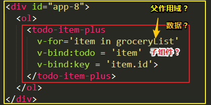
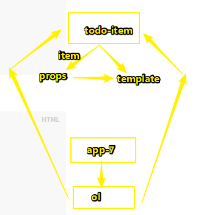

# 介绍

## ★Vue.js 是什么？

按照[官网首页](https://cn.vuejs.org/)的说法，**✎：**

> Vue (读音 /vjuː/，类似于 **view**) 是一套用于构建用户界面的**渐进式框架**。与其它大型框架不同的是，Vue 被设计为可以自底向上逐层应用。

什么鬼？可以进化？一步一步来？？？——好吧，我不知道这是啥意思，我知道CSS有个响应式框架——Bootstrap。

好吧！我只能直译了，**✎：**

这个「[式](https://hanyu.baidu.com/s?wd=%E5%BC%8F&device=pc&from=home)」啥意思？——有个5答案，我选个「样子」好了；那么「[渐进](https://hanyu.baidu.com/s?wd=%E6%B8%90%E8%BF%9B&from=zici)」呢？——指逐步前进、发展 。

那么拼接起来就是，**✎：**

> 呈现出逐步前进样子的JavaScript框架！

怕是需要举例子才能明悟一波了！算了先往下看好了！

看看它有哪些特点，**✎：**

1. 易用

   > 已经会了 HTML、CSS、JavaScript？即刻阅读指南开始构建应用！ 

   怎么算会呢？我并没有太过了解ES6啊！ES5倒是挺熟悉的！HTML的话，这里应该不是指[HTML5](https://developer.mozilla.org/zh-CN/docs/Web/Guide/HTML/HTML5)吧！CSS的话倒不是很熟练，我需要做2个CSS项目练练手就差不多了！然后在找个flex布局和Grid布局练练手！对了，还有响应式布局，一些rem、vw、vh单位都得熟悉熟悉！

   总之，我认为我是可以学Vue.js的

2. 灵活

   > 不断繁荣的生态系统，可以在一个库和一套完整框架之间自如伸缩。 

   具体到例子才能知道了

3. 高效

   > 20kB min+gzip 运行大小 、超快虚拟 DOM 、 最省心的优化 

   [虚拟DOM](https://github.com/y8n/blog/issues/5)？？？关于[gzip](https://juejin.im/entry/58709b9a128fe1006b29cd5d)——Gzip是若干种文件压缩程序的简称 

   20KB min+是最低20KB大小的压缩文件吗？

总之，就是这样，**✎：**

> Vue (读音 /vjuː/，类似于 **view**) 是一套用于构建用户界面的**渐进式框架**。 

### ◇两个概念

「渐进式框架」和「自底向上逐层应用 」到底为何意？

**➹：**

[Vue2.0 中，“渐进式框架”和“自底向上增量开发的设计”这两个概念是什么？ - 知乎](https://www.zhihu.com/question/51907207)

摘录了一些答案，**✎：**

1. 渐进式的含义，徐飞大佬的理解是：没有多做职责之外的事。 即主张最少。

   **总之就是灵活**

2. 渐进式，在不同的阶段，使用vue中不同的功能 

3. Vue作者尤雨溪对Vue的定位，**✎：**

   > 我在做Vue的过程中也在不停地思考它的定位，现在，我觉得它与其他框架的区别就是渐进式的想法，也就是“Progressive”——这个词在英文中定义是渐进，一步一步，不是说你必须一竿子把所有的东西都用上。 

   **➹：**[Vue作者尤雨溪：Vue 2.0，渐进式前端解决方案](https://mp.weixin.qq.com/s?__biz=MzUxMzcxMzE5Ng==&mid=2247485737&amp;idx=1&amp;sn=14fe8a5c72aaa98c11bf6fc57ae1b6c0&source=41#wechat_redirect)、[PPT](http://slides.com/evanyou/progressive-javascript#/)

**我能说这两个概念是一个意思吗？——可以，此时我是这样认为的……**

摘录上面那个链接的一些话，**✎：**

- 为什么要有框架？

  > 1. 框架的存在是为了帮助我们应对复杂度（需求复杂、工具简陋、生产力、受过验证的模式）
  > 2. 框架自身也有复杂度（应用复杂度和工具（框架）复杂度）
  > 3. 工具复杂度是为了处理内在复杂度所做的投资（规模效应、工具太弱、杀鸡用牛刀）

  总之就是问题复杂了，生产力更不上了，为何不用一个框架呢？——重复的事情无需要做

  还有一点就是，不要做多余的事，够用就好！

- 框架选型 ？

  > “Pick the right tool for the job” ——一切都要看场景。 

  你的Web应用有点喜怒无常啊！你说这怎么解决？总不能带你去蹦极吧！

  Web应用此时的内心独白：「怪我咯！这不是你们人类的需求吗？你们人类总喜欢制造问题和解决问题」

- 怎么看前端框架的复杂度？

  前端开发的**工程化**趋势，所谓的工程化有种由小作坊写demo到流水线写demo的味道，而工程化主要体现在自动化、模块化、性能优化等等……总之就是可以写出更好的html、css、js……

  Vue之所以复杂，那是因为前端工程化的势头很猛，导致问题也变得多样出来，于是Vue的设计理念就有了啊！

  **✎：**

  1. 声明式的渲染功能——尽可能地让DOM的更新操作是自动的 
  2. 组件系统——将一个大型的界面切分成一个一个更小的可控单元 
  3. 客户端路由——针对单页应用 ，不做就不需要 
  4. 大规模的状态管理——应用变得很大 ，可维护性 
  5. 构建工具——打包和工程构建 。（放眼前端未来，当[HTTP2](https://developers.google.com/web/fundamentals/performance/http2/?hl=zh-cn)普及后 ，可能会带来构建工具的一次革命 ）

  以上5点是可选的，**不需要一上手就把所有东西全用上** ！其中，**✎：**

  - **声明式渲染和组建系统是Vue的核心库所包含内容** 
  - 客户端路由、状态管理、构建工具都有专门解决方案 。（相互独立，不是很懂！）

回顾那句话，**✎：**

> Vue (读音 /vjuː/，类似于 **view**) 是一套用于构建用户界面的**渐进式框架**。与其它大型框架不同的是，Vue 被设计为可以自底向上逐层应用 。

相较之前，你会有种「确实如此！」的感觉……还有就是你再回顾头去看那个[介绍视频](https://player.youku.com/embed/XMzMwMTYyODMyNA==?autoplay=true&client_id=37ae6144009e277d)的话，结合之前的理性认识去看，你会发现这很[感性](https://www.zhihu.com/question/20195037)！

渐进式的思想，我觉得可以用到生活中去，比如说学习是循环渐进的，你不可能一下子就学会了！你得迭代，不断地加深，最后再浅出！不要杀鸡用牛刀……少把力气用到没有必要用的地方去！还有就是明白效率的概念，明知工具弱，就得学会变通！即便你需要去花大量时间学习工具的使用，但如果能提高效率，那这就是一笔很划算的投资！当然你不要学过头了，即继续学下去不能使你受到启发，也不能提高你的生产效率，总之就是**不要为了学习而学习**，要知道为了什么去学，学这个东西能为你带来什么，能为你改变什么，**能为生活带来哪些正面影响**！


## ★起步

### ◇预备知识

1. 已了解关于 HTML、CSS 和 JavaScript 的中级知识 
2. 有其它框架的使用经验会有帮助，但这不是必需的 


## ★声明式渲染

### ◇何为声明式渲染？

我知道有「声明一个变量并定义这个变量的值」，可是声明式呢？这里可是对了一个「式」字啊！这个式的意思有5个，我选择这个好了，**✎：**

> 一种语法范畴。通过一定的语法形式，表示说话者对所说事情的主观态度。如叙述式、命令式等 

不要咬文嚼字，不然，就不能从整体上理解了。我想我得要跳出固有的编程习惯才行，框架使用起来应该会更贴近日常思维。在这儿Vue直接就可以改DOM元素的数据了，像是直接用对象的方式直接[操作符](http://www.manongjc.com/article/2170.html) `.`就可以了啊！

**➹：**[怎么理解“声明式渲染”？ - 知乎](https://www.zhihu.com/question/68121329)

稍微看了一下，我的理解就是**A要什么，B就得提供什么给A，不管B是怎么弄出来的，A关注的只是结果！**

我没有想过，会有所谓的「声明式编程」和「命令式编程」，在我的认识当中，只有所谓的「面向过程式（pp）」、「面向对象式（oop）」和「函数式（fp）」

我不知道为什么解决一个问题会有那么多姿势！也许是问题的多样性，反正解决同一个问题不止一种姿势！如用α姿势则杀鸡用牛刀，用β姿势则很简洁，而用γ姿势则无法解决，因为这不是它擅长的……

**➹：**[声明式编程和命令式编程有什么区别？ - 知乎](https://www.zhihu.com/question/22285830)、[编程方式](https://zh.wikipedia.org/wiki/%E7%BC%96%E7%A8%8B%E8%8C%83%E5%9E%8B)、[编程范式，程序员的编程世界观 -- 简明现代魔法](http://www.nowamagic.net/librarys/veda/detail/2488)

我看了这个答案，**✎：**

**➹：**[声明式编程和命令式编程有什么区别？ - Jinfeng Hu的回答 - 知乎]( https://www.zhihu.com/question/22285830/answer/469177185 )

这个是最让我感觉有始有终的答案！，我摘录其中的一些内容，**✎：**

> 1. 计算机系统是分层的，也就是下层做一些支持的工作，暴露接口给上层用。注意：语言的本质是一种接口。 （接口吗？语言？）
> 2. 接口的表述方式越接近人类语言——词汇的串行连接（一个词汇实际上是一个概念）——就越“声明式”；越接近计算机语言——“顺序+分支+循环”的操作流程——就越“命令式”。  
> 3. 一种编程思想，在构建自己的代码时，为了结构的清晰可读，把代码分层，层之间的接口尽量声明式。这样你的代码自然在一层上主要描述从人的角度需要什么；另一层上用计算机逻辑实现人的需要。 

关于[接口](https://zh.wikipedia.org/wiki/%E6%8E%A5%E5%8F%A3)——用于沟通的中介物之抽象化 。我理解是A想要与B建立联系，就得要实现B提供的接口咯！就像是JavaScript要想操作HTML文档的话，就得要实现[DOM标准](https://developer.mozilla.org/zh-CN/docs/Web/API/Document_Object_Model/Introduction)咯！（我在想DOM接口是不是DOM标准的一部分，还是说二者是等价的，还是……？？？）

**➹：**[DOM 模型概述 -- JavaScript 标准参考教程（alpha）](https://javascript.ruanyifeng.com/dom/node.html)

### ◇关键信息

1. Vue.js 的核心是一个允许采用简洁的模板语法来声明式地将数据渲染进 DOM 的系统 
2. 在这里一个Vue实例即是一个Vue应用，也就是说可以把一个元素当作是一个Vue应用咯？
3. 数据和 DOM 已经被建立了关联 ，你才能有响应式的感观效果！这个实现 Vue 在背后做了大量工作 

### ◇几个语法

1. 文本插值 ，**✎：** \{\{ message \}\}
2. 绑定元素特性 ， **➹：** `v-bind:title="message"`——「将这个元素节点的 `title` 特性和 Vue 实例的 `message` 属性保持一致 」

>  `v-bind` 特性被称为**指令**。指令带有前缀 `v-`，以表示它们是 Vue 提供的特殊特性。 它们会在渲染的 DOM 上应用特殊的响应式行为。 

体现响应式，往页面的console输入诸如 `app2.message = '新消息'` 这样的信息就会更新绑定了某个特性的HTML


## ★条件与循环

1. `v-if="seen"`：控制切换一个元素是否显示，更具data的seen是否为truly值，**✎：**

   seen的值是这`undefined、null、""、0、NaN、false`6个值当中的其中一个，你就看不到绑定了这个特性的HTML了

   > Vue不仅可以把数据绑定到 DOM 文本或特性，还可以绑定到 DOM **结构**

   一旦为false值，那么它就不会出现在页面的DOM结构里了。

   > Vue 也提供一个强大的过渡效果系统，可以在 Vue 插入/更新/移除元素时自动应用[过渡效果](https://cn.vuejs.org/v2/guide/transitions.html)。

   这是搞页面特效的节奏吗？

   之前一直在想DOM的CRUD操作，怎么没有R呢？难道浏览器开始渲染一个页面，就是一个R的过程？

2. `v-for="todo in todos"`：可以绑定数组的数据来渲染一个项目列表

   这里的todo是Vue实例的data属性中的todos（Vue会提升一级，即你可以不用`app4._data.todos`，真奇怪多了一个下划线！或许这有种`__proto__`的味道 ）

   由于 `todos`的值是数组，那么意味着你开以使用`push()「返回数组长度，对应着列表有多少项」`等数组的API

## ★处理用户输入

### ◇目的

> 为了让用户和你的应用进行交互

### ◇指令

1. 可以用`v-on` 指令添加一个事件监听器，通过它调用在 Vue 实例中定义的方法。**✎：**`v-on:click="reverseMessage"`

   > 通过绑定事件的姿势，一旦用户点击了，就通过`reverseMessage` 方法更新应用的状态。但没有触碰 DOM——所有的 DOM 操作都由 Vue 来处理，你编写的代码只需要关注逻辑层面即可。

   我对「更新应用状态」的理解，通过读写变量，可以记录和读取程序的运行状态！一旦用户作出了某种行为，那么就更新应用的状态，我们没有去触碰DOM的操作，只是通过一些代码更新数据而已，简单来说就是为了一个赋值操作！

2. 也可以用 `v-model` 指令，它能轻松实现表单输入和应用状态之间的双向绑定。**✎：**

   只有input才能实现双向绑定，因为只有这样用户才能输入数据啊！

   总之，我理解所谓的双向在于，用户能直接输入数据更新应用的状态，有这样一种说法「页面（其实也在内存里，但是为了针对双向这个概念，需要单独出来）到内存，内存到页面」就是所谓的双向，我不知道用户的点击算不算一种输入的数据呢？因为 `v-on`指令是单向绑定的，只是应用状态无法由用户直接控制！

## ★？组件化应用构建

### ◇组件系统

> 组件系统是 Vue 的另一个重要概念，因为它是一种抽象，允许我们使用小型、独立和通常可复用的组件构建大型应用

### ◇组件树

> 几乎任意类型的应用界面都可以抽象为一个组件树，**✎：**


当你写CSS的时候，我想脑子里得有一棵树才行……

### ◇Vue的组件化

1. 在Vue 中注册组件很简单
2. 良好的解耦
3. ……

### ◇父作用域？子组件？



这语法是怎样的呢？目前理解起来有点生硬啊！

还是这样呢？ :joy:




### ◇组件化的好处

> 在一个大型应用中，有必要将整个应用程序划分为组件，以使开发更易管理。


### ◇？与自定义元素的关系

Vue 的组件语法部分参考了 [Web 组件规范](https://www.w3.org/wiki/WebComponents/)

## ★准备好了吗？

组件化的语法难以理解，比如说 `prop` 接口

## ★小结

- \{\{message\}\}这里的 \{\{\}\}就像是些占位符！
- Vue有很多指令，每个都有特殊的功能。**✎：**
  1. `v-bind`——绑定元素节点的属性
  2. `v-if`——控制切换一个元素是否显示，体现了Vue可以控制DOM结构
  3. `v-for`——绑定数组的数据来渲染一个项目列表
  4. `v-on` ——添加一个事件监听器
  5. `v-model` ——轻松实现表单输入和应用状态之间的双向绑定
- 组件化的用法，以及其功能需要继续了解
- 元素/属性的文本节点→☞元素节点
- 你的脑子得有一棵树才行，如这个app树，在vue里你只需要改点数据，这棵树就会发生变化了！也就是说数据很关键，决定了你该怎么去构建这颗树，如果数据是数组的话，那么我可以用循环去搞一个列表出来，即给这颗app树多添加些节点；如果数据是布尔类型的话，那么我可以控制元素的显示与否，即是否把它从这个app树中移走！
- 关于Vue的原理，只能等日后能力有了提高后才去了解了！前期先试着用，当然也可以试着猜测它的原理，来解答「为什么这么用，就有了这样的效果呢？」
- 别忘了MVC！！！

## ★Q&A

**①数组的join()方法**

**➹：**[Array.prototype.join() - JavaScript | MDN](https://developer.mozilla.org/zh-CN/docs/Web/JavaScript/Reference/Global_Objects/Array/join)

1. `join()` 方法，不会改变数组！

2. 返回值是个字符串

3. 没有参数，默认为 这个「，」逗号。总之就是

   > 参数就是指定一个字符串来分隔数组的每个元素

4. 如果 **arr.length** 为0，则返回空字符串

**✎：**

```js
[null,undefined].join()  //","
[5,'GG'].join() //"5,GG"
[5,'GG'].join('β') //"5βGG"
```

**②什么叫应用状态？**

**➹：**[状态 - 维基百科，自由的百科全书](https://zh.wikipedia.org/wiki/%E7%8A%B6%E6%80%81)

难道这是个与[状态机](https://zh.wikipedia.org/wiki/%E7%8A%B6%E6%80%81%E6%9C%BA)相关之基本概念？

**➹：**[状态机编程思想？ - 知乎](https://www.zhihu.com/question/31845498)

理解不了，只能通过demo来理解了，根据这个答案来搞一波，**✎：**

> 用状态机去实现一个javascript 的 AST，做完就会用状态机了. 要动手，不要设计那么优美，不要设计的太抽象。

**➹：**[【转向JavaScript系列】AST in Modern JavaScript - 简书](https://www.jianshu.com/p/82894a71376e)

编译器如何理解以下这几行demo？**✎：**

```js
var a = 42;
var b = 5;
function addA(d) {
  	var e = a + d;
    return e;
}
var c = addA(2) + b;
```

在次之前你得有这么一个认识，**✎：**

> 按照语法规则书写的代码，是用来让开发者可阅读、可理解的。对编译器等工具来讲，它可以理解的就是抽象语法树了，在网站[javascript-ast](https://link.jianshu.com/?t=http%3A%2F%2Fresources.jointjs.com%2Fdemos%2Fjavascript-ast)里，可以直观看到由源码生成的图形化语法树

那么它的图形语法树为这个：[传送门](http://otty6pwsj.bkt.clouddn.com/18-8-20/99513701.jpg)

我简单理解起来就是，**✎：**

根→☞变量的声明→☞变量的声明符（a、b等和其对应的结果）

似乎用树的姿势去看demo比较好一点！即站在解释器的角度去看！

而生成抽象语法树需要经过两个阶段：

- 分词（tokenize）——将源码分割成语法单元

  > 语法单元就是那些诸如Keyword（var、return……）、Punctuator（+、=、{……）、Identifier（a、b……）、Numeric（42、5……）……

  可以这样去测试，**✎：**

  ```
  var a = 42;
  var b = 5;
  var x = '55';
  var y = NaN;
  var z = false;
  var o = '';
  var p = [];
  var q = {};
  var r = function(a){};
  var h = undefined;
  var l = null;
  ```

  你会发现语法单元跟你想象当中有点不一样，比如说`undefined、NaN`是个`Identifier`、而`null`有`Null(null)`

- 语义分析(parse)

  > 语义分析是在分词结果之上分析这些语法单元之间的关系

  如一颗树一样，有很多个节点，给我的整体认识就是只需要关注**变量和其值**就可以了

关于语法树的实现，社区中有各种AST parser实现！

到此为止……

**③组件化？我只知道模块化啊！**

**➹：**[什么叫组件化开发? - 知乎](https://www.zhihu.com/question/29735633)、[什么是前端组件化和模块化？ - 简书](https://www.jianshu.com/p/b304614005d4)

