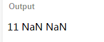

# 模板语法

## ★概述

### ◇你得用合法的HTML

> Vue.js 使用了基于 HTML 的模板语法，允许开发者声明式地将 DOM 绑定至底层 Vue 实例的数据。所有 Vue.js 的模板都是合法的 HTML ，所以能被遵循规范的浏览器和 HTML 解析器解析。

属性和标签名，你最好不要用驼峰的形式去命名，尤其是在命名组件的时候，即你的姿势应该是用中划线，**✎：**

`abc-xyz`

### ◇关于性能

> 在底层的实现上，Vue 将模板编译成虚拟 DOM 渲染函数。结合响应系统，Vue 能够智能地计算出最少需要重新渲染多少组件，并把 DOM 操作次数减到最少。

### ◇能否不用模板？

> 如果你熟悉虚拟 DOM 并且偏爱 JavaScript 的原始力量，你也可以不用模板，[直接写渲染 (render) 函数](https://cn.vuejs.org/v2/guide/render-function.html)，使用可选的 JSX 语法。

我想以我目前的水平，显然是需要模板的！

## ★插值

### ◇文本

#### 数据绑定

> 数据绑定最常见的形式就是使用“Mustache”语法 (双大括号) 的文本插值，**✎：**

```html
<span>Message: {{ msg }}</span>
```

也就是所谓的大胡子语法了啊！这是最常见的一种姿势！

> **Mustache 标签**将会被替代为对应数据对象上 `msg` 属性的值。无论何时，绑定的数据对象上 `msg` 属性发生了改变，插值处的内容都会更新。
>
> 通过使用 [v-once 指令](https://cn.vuejs.org/v2/api/#v-once)，你也能执行一次性地插值，当数据改变时，插值处的内容不会更新。但请留心这会影响到该节点上的其它数据绑定

```html
<span v-once>这个将不会改变: {{ msg }}</span>
```

整体来看，**✎：**

```html
<div id="app">
    <span v-once>这个将不会改变: {{ msg }}</span>
    <br>
    <button v-on:click="msg = '改变msg的值'">Change it</button>
</div>
```

```js
var a = new Vue({
  el: '#app',
  data: {
    msg: '文本'
  }
})
```

在这里，把`{{ msg }}`当作是个Mustache 标签，而这个标签的值正是这个`msg`属性的值，这样做，就是绑定了数据了啊！还有一点就是相较于`Object.freeze()`，`v-once`指令更灵活，它不会针对data中的所有属性！

### ◇原始HTML

#### 没有大胡子还能数据绑定吗？

> 双大括号会将数据解释为普通文本，而非 HTML 代码。为了输出真正的 HTML，你需要使用 `v-html` 指令，**✎：**

```html
<div id="app">
    <p>Using mustaches: {{ rawHtml }}</p>
    <p>Using v-html directive: <span v-html="rawHtml"></span></p>
</div>
```

```js
var a = new Vue({
  el: '#app',
  data: {
    rawHtml: '<p style="color:red;">这是红色的</p>'
  }
})
```

需要主要的是，我用了p标签，本来为认为是这个`rawHtml`会替代视图中个的整个span，然而非也，只是为span添加了内容罢了，**✎：**


总之，**✎：**

> 这个`p`的内容将会被替换成为属性值 `rawHtml`，直接作为 HTML——会忽略解析属性值中的数据绑定。注意，你不能使用 `v-html` 来复合局部模板，因为 **Vue 不是基于字符串的模板引擎**。反之，对于用户界面 (UI)，组件更适合作为可重用和可组合的基本单位。

话说，这个「会忽略解析属性值中的数据绑定」怎么理解？难道是这样吗，**✎：**

```js
var a = new Vue({
  el: '#app',
  data: {
    rawHtml: '<span style="color:red;">这是红色的{{xxx}}</span>',
    xxx: '能看见我吗？'
  }
})
```


这就是说**Vue 不是基于字符串的模板引擎**的？上面那个倒是可以解释啊！可是这个不是解析成了html了吗？真是醉了！

总之，就一句话，用组件去重用！

#### 一个警告

> 你的站点上动态渲染的任意 HTML 可能会非常危险，因为它很容易导致 [XSS 攻击](https://en.wikipedia.org/wiki/Cross-site_scripting)。请只对可信内容使用 HTML 插值，**绝不要**对用户提供的内容使用插值。

也就是说，如果用户输入了一段符合HTML的语法规则的东东会很危险咯！即会导致所谓的[跨站脚本攻击](https://juejin.im/entry/58a598dc570c35006b5cd6b4)咯！

总之，内容不可信就不要对该站点动态渲染任意HTML……

### ◇特性

#### 大胡子能对HTMl标签的属性搞事情吗？

> Mustache 语法不能作用在 HTML 特性上，遇到这种情况应该使用 [v-bind 指令](https://cn.vuejs.org/v2/api/#v-bind)，**✎：**

```html
<div v-bind:id="dynamicId"></div>
```

#### 布尔特性——button的特殊性

在布尔特性的情况下，它们的存在即暗示为 `true`，`v-bind` 工作起来略有不同，在这个例子中：

```html
<button v-bind:disabled="isButtonDisabled">Button</button>
```

如果 `isButtonDisabled` 的值是 `null`、`undefined` 或 `false`，则 `disabled` 特性甚至不会被包含在渲染出来的 `<button>` 元素中。

#### 测试的例子

```html
<div id="app">
    <div v-bind:id="dynamicId">Hello!</div>
    <button v-bind:disabled="isButtonDisabled">Button</button>
    <input type="text" v-bind:disabled="yyy">
</div>
```

```css
#xxx {
  color: red;
}
```

```js
var a = new Vue({
  el: '#app',
  data: {
    dynamicId: 'xxx',
    isButtonDisabled: false,
    yyy: true
  }
})
```


难道`v-bind`所绑定的`disabled`就这么皮？老实说我真找不到什么地方可以使用这个特性？还有就是渲染出来的元素不包含这个特性，那又怎样？

哎……

总之，通过Vue提供的一些指令，我们可以动态地修改HTML的属性值，也就是所谓的特性值，对了，这依旧是变量作为衔接！这是没有大胡子而已，但是有特性！

### ◇[使用 JavaScript 表达式](https://cn.vuejs.org/v2/guide/syntax.html#%E4%BD%BF%E7%94%A8-JavaScript-%E8%A1%A8%E8%BE%BE%E5%BC%8F)

#### 可不可以有点操作符？

> 迄今为止，在我们的模板中，我们一直都只**绑定简单的属性键值**。但实际上，对于**所有的**数据绑定，Vue.js 都提供了完全的 JavaScript 表达式支持。

表达式：操作符+操作数，返回有值的式子

或者就是返回有值就可以了！

```html
`{{ number + 1 }}{{ ok ? 'YES' : 'NO' }}{{ message.split('').reverse().join('') }}<div v-bind:id="'list-' + id"></div>`
```

> 这些表达式会**在所属 Vue 实例的数据作用域**下作为 JavaScript 被解析。有个限制就是，每个绑定都只能包含**单个表达式**，所以下面的例子都**不会**生效。**✎：**

```html
<!-- 这是语句，不是表达式 -->
{{ var a = 1 }}

<!-- 流控制也不会生效，请使用三元表达式 -->
{{ if (ok) { return message } }}
```

我之前在想，不是说好的JavaScript与HTML分离吗？如果仅是表达式那还行吧！况且一般都是喂个变量视图而已！

#### 一个警告

> 模板表达式都被放在沙盒中，只能访问全局变量的一个白名单，如 `Math` 和 `Date` 。你不应该在模板表达式中试图访问用户定义的全局变量。

**✎：**

```html
<div id="app">
    <span>{{c + d}}</span>
    <span>{{c + b}}</span>
    <span>{{c + e}}</span>
</div>
```

```js
var a = new Vue({
  el: '#app',
  data: {
    c: 5,
    d: 6,
    e: undefined
  }
})
var b = 15
```



回顾这句话，**✎：**

> 这些表达式会**在所属 Vue 实例的数据作用域**下作为 JavaScript 被解析

所以，不要在模板表达式中试图访问那全局变量——`b`

## ★[指令](https://cn.vuejs.org/v2/guide/syntax.html#%E6%8C%87%E4%BB%A4)

### ◇概述

#### 是什么？

> 指令 (Directives) 是带有 `v-` 前缀的特殊特性。

老实说，我不太习惯叫特性，叫属性如何？:joy::joy::joy:

#### 需要的值？

> 指令特性的值预期是**单个 JavaScript 表达式**(`v-for` 是例外情况，稍后我们再讨论)。

#### 职责？

> 指令的职责是，当表达式的值改变时，将其产生的连带影响，响应式地作用于 DOM。

对了，什么叫连带影响？——我的理解是，不单只影响自己还影响他人，在这里也就说「你不单只改变了值，而且你还会影响DOM」，**✎：**

```html
<p v-if="seen">现在你看到我了</p>
```

> 这里，`v-if` 指令将根据表达式 `seen` 的值的真假来插入/移除 `<p>` 元素。

这个P元素的内心独白「为什么你能控制我的消失？就因为强加了这个v-if特性给我是吗？让我显示就给个真值，让我消失就给假值！告诉你，开发者我受够了！凭什么操控我的一生？」

### ◇[参数](https://cn.vuejs.org/v2/guide/syntax.html#%E5%8F%82%E6%95%B0)

#### href

> **一些指令**能够**接收一个“参数”**，**在指令名称之后以冒号表示**。例如，`v-bind` 指令可以用于响应式地更新 HTML 特性，**✎：**

```html
<a v-bind:href="url">...</a>
```

> 在这里 `href` 是**参数**，告知 `v-bind` 指令将该**元素的 `href` 特性**与**表达式 `url` 的值绑定**。

之前遇到过`v-if="xxx"`这种姿势的，现在遇到了这种 `v-bind:href ="xxx"`有冒号的！

总之这是与原生HTML元素的属性（特性）邂逅，进一步来说，Vue连元素的原生特性的值也与data绑定起来！真是「贪得无厌」

还有一点就是只有一些指令是这样，不是所有指令都搞个冒号，添加个参数！

#### click

HTML元素可没有这个属性啊！

**➹：**[HTML 属性参考 - HTML（超文本标记语言）- MDN](https://developer.mozilla.org/zh-CN/docs/Web/HTML/Attributes)

> 另一个例子是 `v-on` 指令，它用于监听 DOM 事件，**✎：**

```html
<a v-on:click="doSomething">...</a>
```

> 在这里参数是监听的事件名。我们也会更详细地讨论事件处理。

我的天，这个参数是个监听的事件名！然后这个`doSomething`就是个回调函数吧？

### ◇[修饰符](https://cn.vuejs.org/v2/guide/syntax.html#%E4%BF%AE%E9%A5%B0%E7%AC%A6)

#### 是什么？

> 修饰符 (Modifiers) 是以半角句号 `.` 指明的特殊后缀

#### 干什么？

> 用于指出一个指令应该以特殊方式绑定

#### 举个栗子？

> `.prevent` 修饰符告诉 `v-on` 指令对于触发的事件调用 `event.preventDefault()`

```html
<form v-on:submit.prevent="onSubmit">...</form>
```

可以阻止这个监听表单的submit事件默认提交就刷新页面！

> 在接下来对 [`v-on`](https://cn.vuejs.org/v2/guide/events.html#%E4%BA%8B%E4%BB%B6%E4%BF%AE%E9%A5%B0%E7%AC%A6) 和 [`v-for`](https://cn.vuejs.org/v2/guide/forms.html#%E4%BF%AE%E9%A5%B0%E7%AC%A6) 等功能的探索中，你会看到修饰符的其它例子。

## ★[缩写](https://cn.vuejs.org/v2/guide/syntax.html#%E7%BC%A9%E5%86%99)

### ◇概述

> `v-` 前缀作为**一种视觉提示**，用来**识别模板中 Vue 特定的特性**。当你在使用 Vue.js 为现有标签添加动态行为 (dynamic behavior) 时，`v-` 前缀很有帮助，然而，对于一些频繁用到的指令来说，就会感到使用繁琐。同时，在构建由 Vue.js 管理所有模板的[单页面应用程序 (SPA - single page application)](https://en.wikipedia.org/wiki/Single-page_application) 时，`v-` 前缀也变得没那么重要了。因此，Vue.js 为 `v-bind` 和 `v-on` 这两个最常用的指令，提供了特定简写。

那`v-if`是不需要了吧！按照我目前的理解就是，v-if并不需要冒号，简单来说就是不需要参数，也就是说不需要HTML的原生属性！

总之，这两个常用指令，最好就用简写好了！

### ◇[`v-bind` 缩写](https://cn.vuejs.org/v2/guide/syntax.html#v-bind-%E7%BC%A9%E5%86%99)

```html
<!-- 完整语法 -->
<a v-bind:href="url">...</a>

<!-- 缩写 -->
<a :href="url">...</a>
```

一个冒号，一个参数，这样就搞定了哈！

### ◇[`v-on` 缩写](https://cn.vuejs.org/v2/guide/syntax.html#v-on-%E7%BC%A9%E5%86%99)

```html
<!-- 完整语法 -->
<a v-on:click="doSomething">...</a>

<!-- 缩写 -->
<a @click="doSomething">...</a>
```

这个就是一个@号了啊！而不是一个冒号，或许是因为bind和on的缘故，或许作者喜欢木叶忍者村的标志！

> 它们看起来可能与普通的 HTML 略有不同，但 `:` 与 `@` 对于特性名来说都是合法字符，在所有支持 Vue.js 的浏览器都能被正确地解析。而且，它们不会出现在最终渲染的标记中。缩写语法是完全可选的，但随着你更深入地了解它们的作用，你会庆幸拥有它们。

特姓名都是合法字符！而且渲染的出来的元素也不会出现于其中！既然深入了解这些缩写语法，会觉得庆幸拥有它们！那好吧！以后都用缩写好了！

**✎：**

```html
<div id="app">
    <a :href="url" target='_blank'>{{search}}</a>
    <a @click="doSomething">换个搜索引擎</a>
</div>
```

```js
var a = new Vue({
  el: '#app',
  data: {
    url: 'https://www.baidu.com/',
    search: '百度一下',
    flag: 1
  },
  methods: {
    doSomething: function() {
        switch(this.flag) {
          case 0:
            this.url = 'https://www.baidu.com/'
            this.search = '百度一下'
            this.flag = 1
            break;
          case 1:
            this.url = 'https://www.google.com.hk/?gws_rd=ssl'
            this.search = '谷歌一下'
            this.flag = 0
            break;
        }
    }
  }
})
```


## ★小结

- data和视图紧密相关

- 之后你需要用缩写的姿势了，**✎：**

  `v-bind`和`v-on`→☞`:参数`和`@事件名`

## ★Q&A

### ①什么叫模板语法呢？

我的理解是这样的，**✎：**

JavaScript只需要提供数据，而HTML则会有一些根据模板语法生成的模板，让数据可以填充进去，这样一来我们就不需要使用JavaScript去render这个HTML了！

**➹：**[关于模板引擎的工作方式和性能？ - 知乎](https://www.zhihu.com/question/28466557/answer/241364553)

我没有看看太多内容，**✎：**

没有模板引擎你如何渲染数据，**✎：**

```js
function render(data){
    var html = ''; 
    data.list.forEach(item => {
        html += `<li>${item}</li>`
    });

    return `<ul>${html}</ul>`; 
}
```

这样做虽然可以得到同样的结果，但是性能就不好了，而且编程体验也不好，所以「老天啊！赐予我一种可以填数据的机制吧！我不想自己去写render」。为此，**✎：**

> 模版引擎（比如 ejs, art-template 这样的）应运而生，用于快速 `填充` 数据到网页里面，用起来真是爽，毕竟大家都很懒嘛

有个动词不错叫做「喂」，喂数据

关于工作流程，**✎：**

> 就是喂数据，吐结果，只要模版确定了，喂进去数据就可以得到结果。 其次，按照渲染的位置可以分成前端渲染和后端渲染。

ps：jsp是后端的模板引擎，freeMaker等市面比较流行的是前端的模板引擎

**➹：**[高性能JavaScript模板引擎原理解析 – 腾讯CDC](http://cdc.tencent.com/2012/06/15/%E9%AB%98%E6%80%A7%E8%83%BDjavascript%E6%A8%A1%E6%9D%BF%E5%BC%95%E6%93%8E%E5%8E%9F%E7%90%86%E8%A7%A3%E6%9E%90/)

我看了一点这个，**✎：**

> javascript 模板引擎作为数据与界面分离工作中最重要一环，越来越受开发者关注。

也就是说render（界面）和data就这样分离了啊！这就是Vue.js 使用了基于 HTML 的模板语法的原因吗？

还有评论中提到，**✎：**

> HMTL文件自身就是最好的模板

或许这就可以解释为什么Vue.js使用了基于HTML的模板语法的原因……

好了，暂且打住……

### ②沙盒？

> 在[计算机安全](https://zh.wikipedia.org/wiki/%E8%AE%A1%E7%AE%97%E6%9C%BA%E5%AE%89%E5%85%A8)领域，**沙盒**（英语：sandbox，又译为**沙箱**）是一种安全机制，为运行中的程序提供的隔离环境。通常是作为一些来源不可信、具破坏力或无法判定程序意图的程序提供实验之用[[1\]](https://zh.wikipedia.org/wiki/%E6%B2%99%E7%9B%92_(%E9%9B%BB%E8%85%A6%E5%AE%89%E5%85%A8)#cite_note-1)。
>
> 沙盒通常严格控制其中的程序所能访问的资源，比如，沙盒可以提供[用后即回收](https://zh.wikipedia.org/wiki/%E5%A1%97%E9%8A%B7%E7%A9%BA%E9%96%93)的磁盘及内存空间。在沙盒中，网络访问、对真实系统的访问、对输入设备的读取通常被禁止或是严格限制。从这个角度来说，沙盒属于[虚拟化](https://zh.wikipedia.org/wiki/%E8%99%9A%E6%8B%9F%E5%8C%96)的一种。
>
> 沙盒中的所有改动对[操作系统](https://zh.wikipedia.org/wiki/%E6%93%8D%E4%BD%9C%E7%B3%BB%E7%BB%9F)不会造成任何损失。通常，这种技术被[计算机](https://zh.wikipedia.org/wiki/%E8%AE%A1%E7%AE%97%E6%9C%BA)技术人员广泛用于测试可能[带毒](https://zh.wikipedia.org/wiki/%E8%AE%A1%E7%AE%97%E6%9C%BA%E7%97%85%E6%AF%92)的程序或是其他的[恶意代码](https://zh.wikipedia.org/wiki/%E6%81%B6%E6%84%8F%E8%BD%AF%E4%BB%B6)[[2\]](https://zh.wikipedia.org/wiki/%E6%B2%99%E7%9B%92_(%E9%9B%BB%E8%85%A6%E5%AE%89%E5%85%A8)#cite_note-2)。

一些具体实现，如虚拟机

**➹：** [沙盒 (计算机安全) - 维基百科，自由的百科全书](https://zh.wikipedia.org/wiki/%E6%B2%99%E7%9B%92_(%E9%9B%BB%E8%85%A6%E5%AE%89%E5%85%A8))

总之，就有「隔离」的调调！

### ③disabled？

**➹：**[disabled - Mozilla 产品与私有技术 - MDN](https://developer.mozilla.org/zh-CN/docs/Mozilla/Tech/XUL/Attribute/disabled)

### ④特性名？

**➹：**[特性列表 - 神奇宝贝百科，关于精灵宝可梦的百科全书](https://wiki.52poke.com/zh-hans/%E7%89%B9%E6%80%A7%E5%88%97%E8%A1%A8)


特性有种能力、功能的调调！

属性名与特性名？都是一个意思！只是换了个马甲