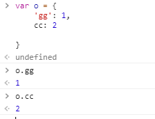
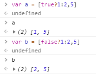
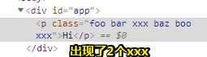
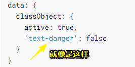

# [Class 与 Style 绑定](https://cn.vuejs.org/v2/guide/class-and-style.html)

## ★概述

### ◇数据绑定的一个常见的需求

> 操作元素的 class 列表和内联样式是数据绑定的一个常见需求

为什么这么说呢？

> 因为它们都是属性，所以我们可以用 `v-bind` 处理它们：只需要通过表达式计算出字符串结果即可。

然而有个麻烦事，**✎：**

> 字符串拼接麻烦且易错

所以，**✎：**

> 在将 `v-bind` 用于 `class` 和 `style` 时，Vue.js 做了专门的增强。表达式结果的类型除了字符串之外，还可以是对象或数组。

哈！一直都以为只有字符串的结果！没想到对象或数组这些复杂数据类型也是可以的！不过话说来，这会显示成什么样子？

## ★[绑定 HTML Class](https://cn.vuejs.org/v2/guide/class-and-style.html#%E7%BB%91%E5%AE%9A-HTML-Class)

### ◇[对象语法](https://cn.vuejs.org/v2/guide/class-and-style.html#%E5%AF%B9%E8%B1%A1%E8%AF%AD%E6%B3%95)

#### 喂个什么东西给`v-bind:class`吃好呢？

> 我们可以传给 `v-bind:class` 一个对象，以动态地切换 class：

```html
<div v-bind:class="{ active: isActive }"></div>
```

> 上面的语法表示 `active` 这个 class 存在与否将取决于数据属性 `isActive` 的 [truthiness](https://developer.mozilla.org/zh-CN/docs/Glossary/Truthy)。

以前都在说真的值，和假的值，原来英文是Truthy和Falsy

#### 传入更多的属性？

> 你可以在对象中传入更多属性来动态切换多个 class。

请看这个模板，**✎：**

```html
<div class="static"
     v-bind:class="{ active: isActive, 'text-danger': hasError }">
</div>
```

还有这个data，**✎：**

```js
data: {
  isActive: true,
  hasError: false
}
```

可见，**✎：**

> `v-bind:class` 指令也可以与普通的 class 属性共存

> 结果渲染为：

```html
<div class="static active"></div>
```

最终归一，总之，模板语法更为强大！

还有就是，**✎：**

> 当 `isActive` 或者 `hasError` 变化时，class 列表将相应地更新。例如，如果 `hasError`的值为 `true`，class 列表将变为 `"static active text-danger"`。

这个class列表，指的是这个元素的class属性有哪几个值哈！

#### 不想喂那么多东西给`v-bind:class`吃

> 绑定的数据对象不必内联定义在模板里：

```html
<div v-bind:class="classObject"></div>
```

```js
data: {
  classObject: {
    active: true,
    'text-danger': false
  }
}
```

> 渲染的结果和上面一样

总之，你只需要看见这个渲染的结果是怎样的就可以了！如这个元素的class列表就有个`active`

话说回来为啥这个用了单引号，虽然我知道对象的语法也是可以这样的！



#### 其它姿势

> 我们也可以在这里绑定一个返回对象的[计算属性](https://cn.vuejs.org/v2/guide/computed.html)。这是一个**常用且强大**的模式：

```html
<div v-bind:class="classObject"></div>
```

```js
data: {
  isActive: true,
  error: null
},
computed: {
  classObject: function () {
    return {
      active: this.isActive && !this.error,
      'text-danger': this.error && this.error.type === 'fatal'
    }
  }
}
```

这个很常用啊！反正用到了复杂的逻辑表达！

话说这个fatal应该是错误的类型！

### ◇[数组语法](https://cn.vuejs.org/v2/guide/class-and-style.html#%E6%95%B0%E7%BB%84%E8%AF%AD%E6%B3%95)

#### 不管是你是不是truthy值，直接赋值

> 我们可以把一个数组传给 `v-bind:class`，以应用一个 class 列表：

```html
<div v-bind:class="[activeClass, errorClass]"></div>
```

```js
data: {
  activeClass: 'active',
  errorClass: 'text-danger'
}
```

> 渲染为：

```html
<div class="active text-danger"></div>
```

在这儿并没有说到，你这个值是falsy值，就没有这个class了，而是直接一个赋值！即不需要判断！

#### 需要条件切换

> 如果你也想根据条件切换列表中的 class，可以用三元表达式：

```html
<div v-bind:class="[isActive ? activeClass : '', errorClass]"></div>
```

我从未在数组中这样定义一个元素，原来还可以用表达式，其实想想也知道，毕竟返回了一个值，只是我没想到可以计算罢了！**✎：**



如果我没有测试，我真得会以为这是Vue做了某种封装！

言归正传，**✎：**

> 这样写将始终添加 `errorClass`，但是只有在 `isActive` 是 truthy[[1\]](https://cn.vuejs.org/v2/guide/class-and-style.html#footnote-1) 时才添加 `activeClass`。

ps：[1] truthy 不是 `true`，详见 [MDN](https://developer.mozilla.org/zh-CN/docs/Glossary/Truthy) 的解释。

> 不过，当有多个条件 class 时这样写有些繁琐。

#### 你喜欢用数组？那总得留个坑给对象吧！

> 在数组语法中也可以使用对象语法：

```html
<div v-bind:class="[{ active: isActive }, errorClass]"></div>
```

数组与对象的混合，如果`isActive`为truthy值就往该元素的class列表中添上一个`active`。:smirk::smirk::smirk:

老实说，数组的姿势更直观一点！即无须判断！之前对象的那种方式，是根据value来选择key，而这个这就是value来作为class列表的成员，如果我把数组的元素当作是value的话，那就是有点和对象唱反调了！

### ◇[用在组件上](https://cn.vuejs.org/v2/guide/class-and-style.html#%E7%94%A8%E5%9C%A8%E7%BB%84%E4%BB%B6%E4%B8%8A)

> 这个章节假设你已经对 [Vue 组件](https://cn.vuejs.org/v2/guide/components.html)有一定的了解。当然你也可以先跳过这里，稍后再回过头来看。

有一定了解，所以我是可以看的！

#### clas属性与组件

> 当在一个自定义组件上使用 `class` 属性时，这些类将被添加到该组件的根元素上面。这个元素上**已经存在的类不会被覆盖**。

> 例如，如果你声明了这个组件：

```js
Vue.component('my-component', {
  template: '<p class="foo bar">Hi</p>'
})
```

> 然后在使用它的时候添加一些 class：

```html
<my-component class="baz boo"></my-component>
```

> HTML 将被渲染为:

```html
<p class="foo bar baz boo">Hi</p>
```

我测试了一下，对组件和class都添加个`xxx`也没有出现重复的就去掉，**✎：**



#### 数据绑定 class与组件

> 对于带数据绑定 class 也同样适用：

```html
<my-component v-bind:class="{ active: isActive }"></my-component>
```

> 当 `isActive` 为 truthy[[1\]](https://cn.vuejs.org/v2/guide/class-and-style.html#footnote-1) 时，HTML 将被渲染成为：

```js
<p class="foo bar active">Hi</p>
```

总之，之后的视角，你应该有把这个app看作是渲染过后元素的庐山真面目的能力！

简单来说，就是编译过后的结果你要明确！

## ★[绑定内联样式](https://cn.vuejs.org/v2/guide/class-and-style.html#%E7%BB%91%E5%AE%9A%E5%86%85%E8%81%94%E6%A0%B7%E5%BC%8F)

### ◇[对象语法](https://cn.vuejs.org/v2/guide/class-and-style.html#%E5%AF%B9%E8%B1%A1%E8%AF%AD%E6%B3%95-1)

#### 非常像的style

> `v-bind:style` 的对象语法十分直观——看着非常像 CSS，但其实是一个 **JavaScript 对象**。CSS 属性名可以用驼峰式 (camelCase) 或短横线分隔 (kebab-case，记得用单引号括起来) 来命名：

```js
<div v-bind:style="{ color: activeColor, fontSize: fontSize + 'px' }"></div>
```

```js
data: {
  activeColor: 'red',
  fontSize: 30
}
```

对比一下所谓的原生内联样式，**✎：**

```html
<h2 style="font-family:'微软雅黑';color:#FF0000"></h2>
```

确实好像。

对了，这个单引号括起来上文我有疑问过，如果有短横线就这么干，**✎：**



为什么？之前有了解到则是W3C的规范

#### HTML内容显得过长了

> 直接绑定到一个样式对象通常更好，这会让模板更清晰：

```html
<div v-bind:style="styleObject"></div>
```

```js
data: {
  styleObject: {
    color: 'red',
    fontSize: '13px'
  }
}
```

> 同样的，**对象语法常常结合返回对象的计算属性使用。**

别忘了，复杂的逻辑表达式，还是交给我计算属性吧！除非你有异步操作等……如果有的话，那就交给`methods`好了！

### ◇[数组语法](https://cn.vuejs.org/v2/guide/class-and-style.html#%E6%95%B0%E7%BB%84%E8%AF%AD%E6%B3%95-1)

> `v-bind:style` 的数组语法可以将多个样式对象应用到同一个元素上：

```html
<div v-bind:style="[baseStyles, overridingStyles]"></div>
```

没想到，是这样用的！即直接扔这些元素变量过来！

### ◇[自动添加前缀](https://cn.vuejs.org/v2/guide/class-and-style.html#%E8%87%AA%E5%8A%A8%E6%B7%BB%E5%8A%A0%E5%89%8D%E7%BC%80)

> 当 `v-bind:style` 使用需要添加[浏览器引擎前缀](https://developer.mozilla.org/zh-CN/docs/Glossary/Vendor_Prefix)的 CSS 属性时，如 `transform`，Vue.js 会自动侦测并添加相应的前缀。

很sweet的操作！:+1::+1::+1:

### ◇[多重值](https://cn.vuejs.org/v2/guide/class-and-style.html#%E5%A4%9A%E9%87%8D%E5%80%BC)

> 2.3.0+

> 从 2.3.0 起你可以为 `style` 绑定中的属性提供一个包含多个值的数组，常用于提供多个带前缀的值，例如：

```html
<div :style="{ display: ['-webkit-box', '-ms-flexbox', 'flex'] }"></div>
```

> 这样写只会渲染数组中最后一个被浏览器支持的值。在本例中，如果浏览器支持不带浏览器前缀的 flexbox，那么就只会渲染 `display: flex`。

反正就是第一选择为不带前缀的！如果不支持，那就选择个浏览器支持的呗！

## ★小结

- 操作元素的 class 列表和内联样式是**数据绑定**的一个常见需求
- 你可以很方便地改变元素的class列表了！
- CSS 属性名可以用驼峰式 (camelCase) 或短横线分隔 (kebab-case，记得用单引号括起来) 来命名

